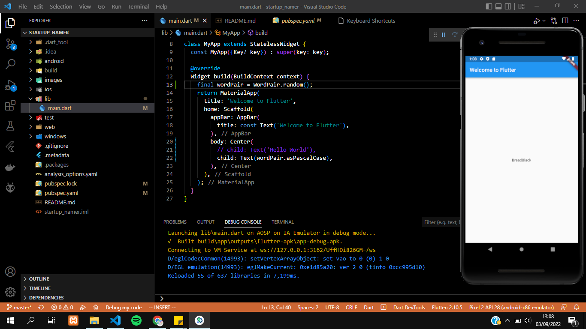

# startup_namer

A new Flutter project.

## Create the starter Flutter app
Pada percobaan ini membuat projek baru dengan nama startup_namer. Hasil dari percobaan ini yaitu akan menampilkan text "Hello World"

## Use an external package
Pada percobaan ini menambahkan package bernama english_words
